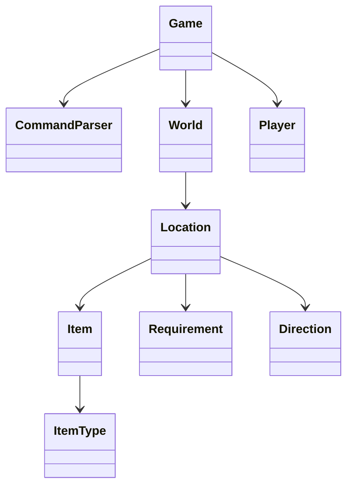

# Enchanted Forest

[](https://github.com/Bahareh527/Enchanted-Forest/actions/workflows/ci.yml)

A dependency-free, console-based adventure game written in Java 17. Explore a dangerous forest, collect and use items, solve environmental obstacles, manage a limited inventory, and recover the treasure.

This repository is a polished portfolio edition of a collaborative university project. It preserves the original gameplay concept while separating the command parser, game engine, domain model, and world construction so each part can be tested independently.

## Highlights

- Case-insensitive command parser with multi-word item names and direction shortcuts
- Seven connected locations with locks, hazards, item puzzles, and a clear win condition
- Inventory capacity, health, healing, victory, defeat, and voluntary-exit states
- Deterministic game engine that is independent of console input/output
- Dependency-free automated tests and GitHub Actions continuous integration
- Java 17 records, enums, immutable views, and focused domain classes

## Quick start

Requirements: JDK 17 or newer. No build tool or external library is required.

On macOS or Linux:

```bash
bash scripts/run.sh
```

On Windows PowerShell:

```powershell
./scripts/run.ps1
```

The scripts compile the source into the ignored `build/` directory and start the game.

## Commands

| Command | Purpose |
| --- | --- |
| `look` | Describe the current location, items, and exits |
| `go <direction>` | Move north, east, south, or west |
| `north`, `east`, `south`, `west` | Direction shortcuts |
| `take <item>` | Put an item in the inventory |
| `drop <item>` | Leave an item in the current location |
| `use <item>` | Use a tool or health potion |
| `examine <item>` | Read an inventory item's description |
| `inventory` | List carried items and remaining capacity |
| `status` | Show health and current location |
| `map` | Display a compact map |
| `help` | Show the command reference |
| `quit` | Leave the game |

## World map

```text
                         [Treasure Sanctuary]
                                   |
                              [Dark Cave]
                                   |
     [Moonlit Clearing] --- [Ancient Gate]
              |                    |
       [Spider Grove] ----- [Forest Entrance] ----- [Bottomless Lake]
```

Some routes are unsafe or blocked until the correct item is used. The map shows connectivity, not the solution.

<details>
<summary>Show a sample winning route (spoiler)</summary>

```text
take sword
use sword
go west
take golden key
go east
use golden key
go north
take torch
use torch
go north
go north
take enchanted treasure
```

</details>

## Architecture



`Game` returns a `CommandResult` for every action instead of printing directly. `Main` is the small console adapter. This makes gameplay behavior easy to test without simulating keyboard input.

## Tests

Run the complete verification suite:

```bash
bash scripts/verify.sh
```

or on Windows:

```powershell
./scripts/verify.ps1
```

The suite covers parsing, inventory limits, obstacles, health recovery, hazards, and the complete winning route.

## Reuse

This public portfolio repository does not currently grant an open-source license. Copyright remains with the project contributors. Please obtain permission from the relevant contributors before copying, modifying, or redistributing the code.
